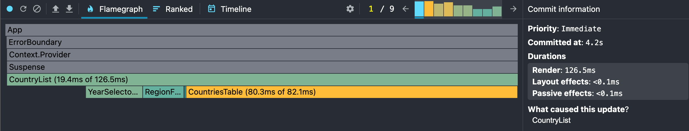
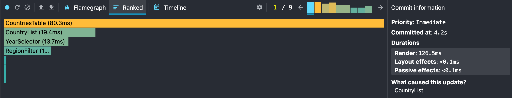
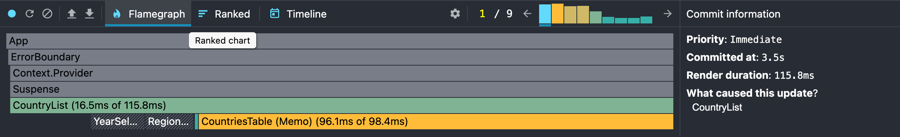
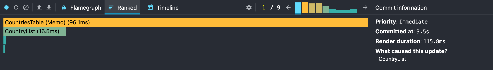

# CO2 Countries App Performance Profiling

This document shows how to profile and compare the performance of the CO2 Countries App before and after React optimizations (useMemo, useCallback, React.memo).

---

## **Step 1: Initial Profiling (Without Optimizations)**

1. Open the app in Chrome.
2. Open React DevTools → Profiler tab.
3. Start profiling **after the page has fully loaded**.
4. Interact with the app:
    - Sort columns (by name and population)
    - Search for a country
    - Change selected year
    - Apply/remove extra columns
5. Stop profiling and take screenshots of:
    - **Flame Graph**
    - **Ranked Chart**

**Screenshots example:**

---

## **Step 2: Optimizations**

1. Use `React.memo` for components like `CountriesTable`.
2. Use `useMemo` to memoize derived data (`filtered`, `sorted`, `sortedFilteredData`).
3. Use `useCallback` to memoize event handlers.

---

## **Step 3: Profiling After Optimizations**

1. Repeat **Step 1** actions on the optimized app.
2. Take screenshots of **Flame Graph** and **Ranked Chart** again.
3. Compare results:
    - Check if **Commit Duration** decreased.
    - Check if **Render Duration** for heavy components decreased.
    - Observe if unnecessary re-renders are reduced.

**Screenshots example:**

**Conclusion:**

-   Optimizations should reduce render times and unnecessary re-renders.
-   Flame Graph becomes shorter, and Ranked Chart shows fewer slow components.
